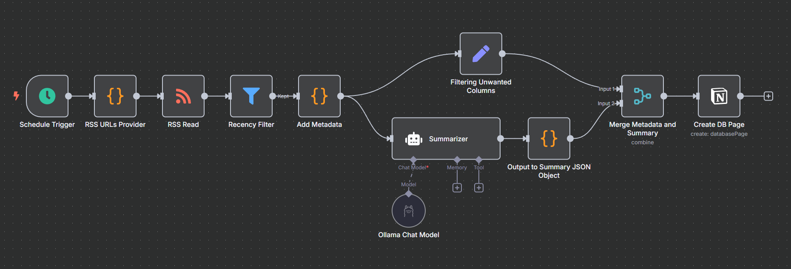
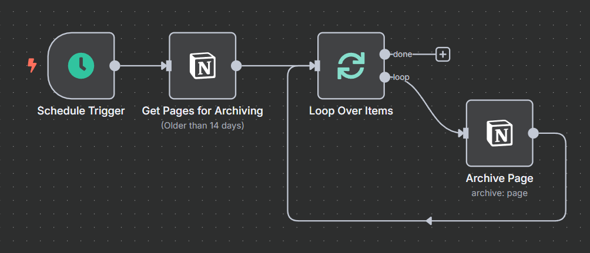

# Chronicle AI Feed Summarizer

Chronicle is an automated data processing pipeline designed to aggregate and summarize content from RSS feeds. 
It leverages a local Large Language Model (LLM) via Ollama to generate concise summaries and extract relevant metadata, 
creating a curated and manageable content feed.

The entire system is built with n8n workflows and runs locally with Ollama, ensuring complete data privacy and 
user control.

## Table of Contents

* [Core Functionality](#core-functionality)
* [Prerequisites](#prerequisites)
* [Installation and Setup](#installation-and-setup)
* [Workflow Architecture](#workflow-architecture)
  * [Workflow 1: `ChronicleFeed` (Ingestion & Summarization)](#workflow-1-chroniclefeed-ingestion--summarization)
    * [LLM Configuration](#llm-configuration)
  * [Workflow 2: `ChronicleClean` (Data Retention)](#workflow-2-chronicleclean-data-retention)

## Core Functionality

- **Automated Content Summarization**: Generates a single-sentence summary for each feed item using a local LLaMA 3 model.
- **Intelligent Tag Extraction**: Analyzes content to identify and filter for the four most relevant topical tags.
- **Scheduled Data Pruning**: A periodic cleanup workflow automatically removes entries older than a specified retention period (default is 14 days).
- **Configurable and Extensible**: The RSS sources, AI prompt, model parameters, and data retention policies are easily customizable within the n8n workflows.
- **Local-First and Private**: All processing occurs locally. No data is transmitted to external or third-party services.

## Prerequisites

To deploy and operate this project, the following components must be installed and operational:

- **[n8n](https://n8n.io)**: An active n8n instance. Self-hosting via Docker is the recommended deployment method.
- **[Ollama](https://ollama.com)**: A running local instance of the Ollama service.
- **LLaMA 3 Model**: The required model must be downloaded through the Ollama CLI:

```
ollama pull llama3
```

## Installation and Setup

To deploy the Chronicle system, follow these steps:

1. **Deploy n8n**

    If a running n8n instance is not already available, you can quickly launch one using Docker.
    
    First, create a dedicated Docker volume to ensure your n8n data persists even if the container is removed or recreated: 
    
    ```
    docker volume create n8n_data
    ```

    Next, run the n8n container. This command will start n8n, map it to port 5678, and connect it to the data volume you 
    just created:
    
    ```
    docker run -d --restart unless-stopped --name n8n -p 5678:5678 -v n8n_data:/home/node/.n8n docker.n8n.io/n8nio/n8n
    ```
    
    The n8n UI will now be accessible in your browser at http://localhost:5678.


2. **Import n8n Workflows**

    1. Download the ChronicleFeed.json and ChronicleClean.json workflow files from this repository.
    2. Navigate to your n8n instance, select Workflows, and use the Import from File option to upload both JSON files.

3. **Configure and Activate Workflows**

   1. Open the **ChronicleFeed** workflow in the n8n editor.
   2. Select the **RSS URLs Provider** node. Modify the `rssFeeds` object to include your target RSS feeds.
   

   ```javascript
   // Example format
   {
       name: "Example News Site",
       url: "https://www.example.com/rss"
   }
   ```

   3. Activate both the `ChronicleFeed` and `ChronicleClean` workflows using the activation toggle in the top-right corner of the editor.
   
The system is now operational.

## Workflow Architecture

The project is composed of two distinct n8n workflows that handle data processing and maintenance.

### Workflow 1: `ChronicleFeed` (Ingestion & Summarization)

This is the primary data ingestion and processing workflow, which executes on a 3-hour schedule.

- **Fetches** new items from the configured RSS sources.
- **Interfaces** with the Ollama API to pass content to the LLaMA 3 model for summarization and tag extraction.
- **Parses** the structured JSON response from the LLM.
- **Stores** the enriched data, filtering out any duplicate entries.



#### LLM Configuration

Interaction with the LLM is defined by a specific prompt template and model parameters to ensure consistent, 
structured output.

**Prompt Template**: 

```text
You are an AI assistant for summarizing blog or news content. For each input item, return a very brief summary 
(1 sentence) of the content, and extract the top 4 most important tags (excluding any that are duplicates, author names, 
or irrelevant).

Here is the blog post:

Title: {{ $json["title"] }}
URL: {{ $json["link"] }}
Published: {{ $json["pubDate"] }}

Tags: {{ $json.category }}

Content:
{{ $json.description }}

Respond only in valid JSON format, like this (no extra commentary, no markdown, just plain JSON):

{
  "summary": "...",
  "category": ["tag1", "tag2", "tag3", "tag4"]
}

Rules for tags:

- Only keep the 4 most relevant and distinct tags.
- Ignore any tags that match or closely resemble the author’s name.
- Avoid near duplicates (e.g., singular/plural, case variants, similar meaning).
- Order by relevance to the content, not by appearance.
```

**Model Parameters**:

| Parameter   | Value    | Rationale                                      |
|-------------|----------|------------------------------------------------|
| Model       | `llama3` | Specifies the local model for generation.      |
| Temperature | `0.3`    | Ensures more deterministic and factual output. |
| Top P       | `0.9`    | Uses nucleus sampling for coherent generation. |

### Workflow 2: `ChronicleClean` (Data Retention)

This scheduled workflow handles data retention, running daily.

- **Queries** the data store to identify all entries with a timestamp older than 14 days.
- **Executes** a delete operation for the identified entries.



The retention period is configurable. To modify it, edit the date filter expression in the Notion node. 
For a 30-day retention, the expression would be:

```javascript
// Modify the integer "14" to the desired retention period in days.
{{ new Date(Date.now() - 14 * 24 * 60 * 60 * 1000).toISOString() }}
```
